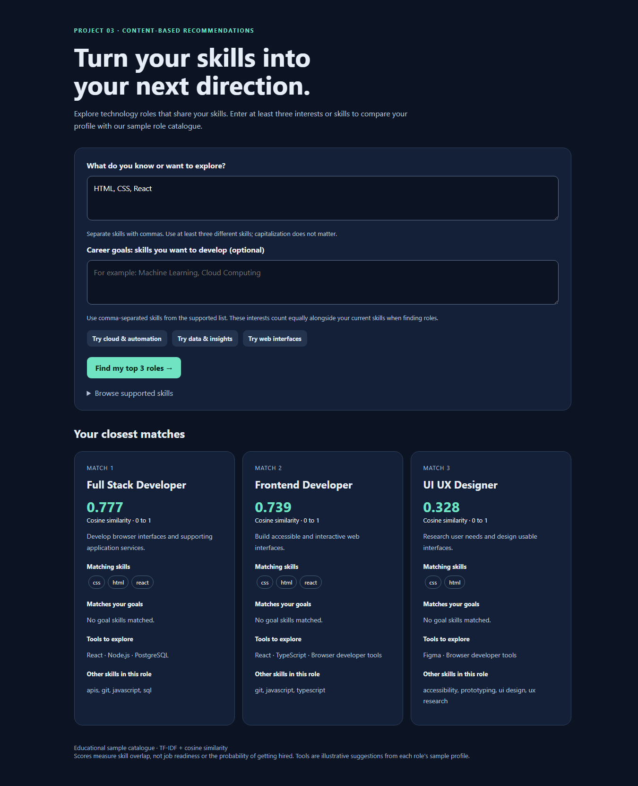
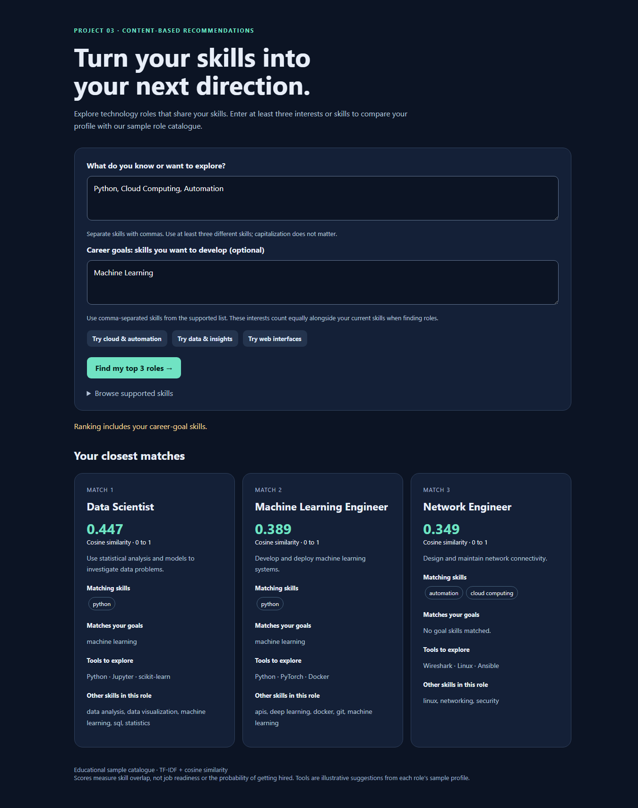
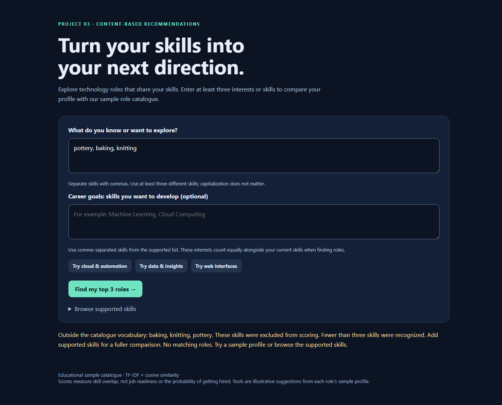
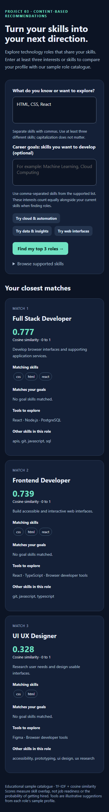

# Project 3: Tech Stack Recommender

## Objective

Build an explainable content-based recommender that accepts at least three skills or interests and returns up to three relevant technology career paths. The project follows the input–process–output workflow in the supplied training document, using TF-IDF weighting and cosine similarity.

## Dataset and scope

The system uses `raw_skills.csv`, an authored educational catalogue of 18 roles. Each row contains a role title, semicolon-separated skills, illustrative tools/platforms, and a description. The catalogue is a demonstration dataset, not a verified sample of job postings. The separately supplied retail-order workbook does not describe technology careers and is not used.

Only skill features affect ranking. Tools and descriptions explain a selected role; they are not independently scored. Example catalogue roles include Cloud Engineer, Data Scientist, Frontend Developer, and DevOps Engineer.

## Method

1. Collect at least three comma-separated current skills or interests. Optional career goals specify skills the user wants to develop.
2. Normalize case and whitespace, resolve explicit aliases such as cloud → cloud computing, and remove duplicates. Disclose unknown terms instead of silently inventing meanings.
3. Build one shared vocabulary from the role catalogue. Treat multiword skills such as cloud computing as whole features. Merge recognized goal skills with recognized current skills to form a preference profile.
4. Calculate term frequency as the skill count divided by the number of recognized skills in that profile. Calculate inverse document frequency as `ln(N / df)`, where N is the number of roles and df is the number containing that skill. Multiply TF and IDF.
5. Compare the profile with every role using `cosine = dot(user, role) / (norm(user) × norm(role))`. A zero denominator returns zero safely.
6. Sort by descending similarity, break ties by role name, and return the first three positive-score roles. Display matching current skills, matching goal skills, tools, and other skills in each role.

This follows the formula on page 12 of the training document. Since inputs are deduplicated, TF is constant within each vector; this factor cancels in the browser's equivalent cosine calculation. The browser uses IDF weights generated from the Python catalogue, and cross-language tests verify agreement.

## User experience and implementation

Open `index.html` directly in a modern browser. The catalogue and matching script are embedded, so neither a backend connection nor an internet connection is needed to calculate results. The interface includes example profiles, a supported-skill list, distinct messages for invalid or unknown inputs, and a responsive layout.

Python provides the same matching engine through a CLI and optional local HTTP server. For example:

```text
python recommender.py --skills "Python,Cloud Computing,Automation"
python recommender.py --skills "Python,Cloud Computing,Automation" --goals "Machine Learning"
```

The minimum input requirement handles user cold starts by collecting explicit preferences immediately. New roles can be included by adding their metadata to the CSV and rebuilding the embedded catalogue with `python build_page.py`. No purchase history, tracking, demographic inference, or collaborative filtering is required.

## Measured examples

The following values were calculated from the final unsmoothed-IDF implementation and rounded to three decimals for display.

| Current skills | Optional goal | Ranked results and cosine scores |
| --- | --- | --- |
| Python; Cloud Computing; Automation | None | Network Engineer 0.559; Cloud Engineer 0.525; Data Engineer 0.507 |
| HTML; CSS; React | None | Full Stack Developer 0.777; Frontend Developer 0.739; UI UX Designer 0.328 |
| SQL; Statistics; Data Analysis | None | Data Analyst 0.701; Data Scientist 0.701; Cybersecurity Analyst 0.282 |
| Python; Cloud Computing; Automation | Machine Learning | Data Scientist 0.447; Machine Learning Engineer 0.389; Network Engineer 0.349 |

The cloud example illustrates why similarity is not a simple overlap count: Network Engineer shares only two entered skills, but common Python has a low IDF weight, while every role's other features affect vector normalization. Likewise, Full Stack Developer outranks Frontend Developer for the three web skills because of the remaining weighted features in each profile. These outcomes follow the catalogue and formula; they are not claims that those roles are objectively better career choices.

The optional Machine Learning goal changes the preference vector and therefore the ranking. The interface identifies goal-related matches separately, so an aspiration is not presented as an existing skill.

## Verification

`python verify_project.py` passes 11 Python tests and compares Python/browser results across 6,009 profiles. Coverage includes known cosine geometry, exact-role matching, aliases, duplicate rejection, deterministic ordering, unknown skills, partial profiles, the document's IDF formula, goals, universal zero-IDF features, and local API behavior. Browser/Python scores are compared with a tolerance of 1e-12.

The form script is also exercised with a simulated DOM and network access disabled. Separately, real headless Chrome 151 checks passed on 18 September 2026: standalone catalogue loading, three rendered matches, optional goals, insufficient inputs, duplicate aliases, unknown inputs, partial-profile guidance, mobile overflow checks, and absence of JavaScript runtime exceptions. Desktop and mobile screenshots were visually reviewed. The evidence is recorded in `evidence/browser-checks.json` and the four PNG screenshots. This is a desktop Chrome test with mobile viewport emulation, not testing on a physical phone or every browser.

No held-out labels or measured employment outcomes are supplied, so these checks establish implementation correctness and interface behavior, not recommendation accuracy against real-world outcomes.

## Limitations and future improvements

The small authored catalogue determines the results and omits many roles and skills. Aliases are explicit; the app does not interpret arbitrary prose, experience levels, or skill proficiency. Goals are represented by desired skills, not a separately validated career-planning model. Current and goal skills have equal weight before IDF. A larger reviewed dataset, skill proficiency controls, and relevance labels for evaluation would improve a future version.

## Source

User-supplied `Artificial_Intelligence_Project_3_Word (1).docx`, especially pages 4, 7–9, 11–19, and 22–23. The separate `REQUIREMENTS_AUDIT.md` accounts for all 26 pages and distinguishes required implementation from instructional examples.

## Screenshot evidence

### Desktop recommendations

Actual standalone browser output for HTML, CSS, and React.



### Career goals

Actual output for Python, Cloud Computing, and Automation with Machine Learning as a desired skill.



### No matching skills

Unknown inputs receive guidance rather than arbitrary recommendations.



### Mobile layout

Chrome viewport emulation at 390 pixels wide; the results stack vertically without horizontal overflow.


